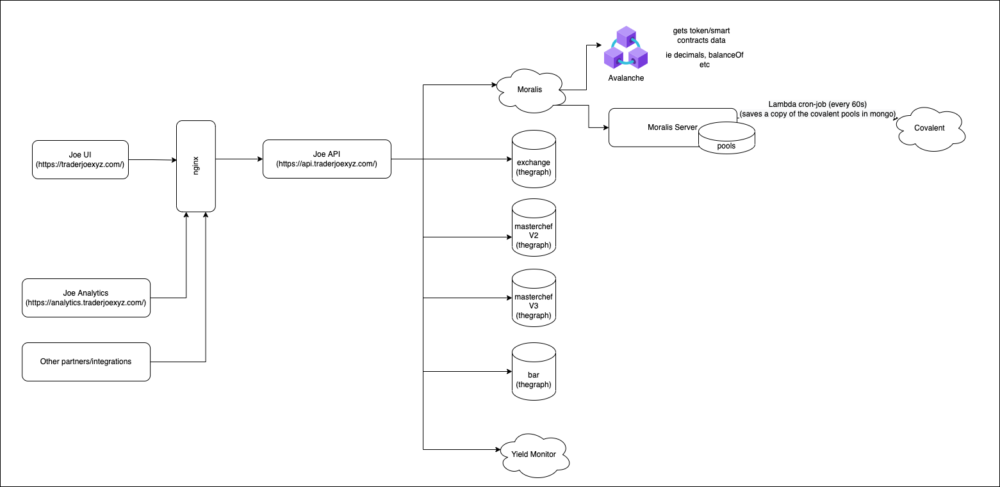
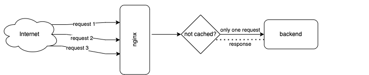
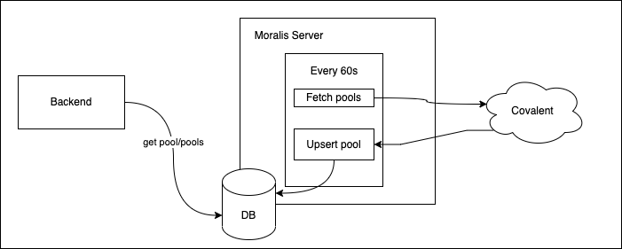

# Trader Joe API

A brand new Trader Joe API that aims to replace the [current trader joe API](https://github.com/traderjoe-xyz/joe-api). This was developed in the context of the Moralis + Avalanche hackathon between Dec 2021 and Jan 2022. 

This new API has been designed to be backwards compatible with the existing API (from now on, legacy API), and it contains a new set of endpoints that should be more future proof for integrations with partners or other systems of the Trader Joe ecosystem, such as the analytics dashboards. 

## Architecture



### Rate limiting
The node backend has no configuration whatsoever regarding rate limiting. The API relies on an nginx that is in front of it. 
The reason why we went this way is that nginx is battle tested and it has been designed for this, and we didn't want to reinvent the wheel. 

### Caching
We used nginx for caching for the exact same reason we used it for rate limiting. This means that the cache is on the protocol level, and it simplifies the backend code a lot as it removes the need for in-memory caches everywhere, which can be confusing and error-prone. Caching can be improved further as needed, with specific ttl for different endpoints and so on. 

One important note regarding caching is that nginx is configured so that if multiple concurrent requests are incoming, only one of them will be sent to the backend, and the rest will wait for the response (again, nginx handles this). This means that one request may take longer than the rest, but the overall performance of the API is a lot better. 

It has also been tested with a `memcached` as a cache backend and it worked fine out of the box. The reason why memcached is not currently used in production is that it was a little bit hard to configure it in Heroku and it was not a high-prio thing. 



### Data sources
The Trader Joe UI, the legacy API and the analytics dashboard fetch data from both [smart contracts](https://github.com/traderjoe-xyz/joe-core) and [thegraph](https://github.com/traderjoe-xyz/joe-subgraphs). 

This new API does the same, but when possible, it also fetches data from different sources, such as [Moralis](https://moralis.io/) (for example token price or calling smart contract methods), [Covalent](https://www.covalenthq.com/) (pools), or Yield Monitor (farms). Adding more data sources is definitely possible, but at the moment, other sources are not as reliable as the ones being used.

The more complete and production-ready these data sources are, the less this API will depend on thegraph. 

### Cron-job in Moralis
We decided to use Covalent to fetch [pools data](https://www.covalenthq.com/docs/api/#/0/Class-B/Get-XY=K-Pools-by-Address/lng=en), as a replacement to thegraph. We found that the data was not as fresh as thegraph (there was like a 30s delay), and the response time was really bad sometimes (like 4, 5 seconds or even more). 

To address this, we decided to cache the covalent data as is in our own data storage. This storage is the database that comes with [Moralis](https://docs.moralis.io/moralis-server/database), and to populate it, we created a simple [Moralis Cloud Function](https://docs.moralis.io/moralis-server/cloud-code/cloud-functions) that runs every minute (we wish it ran faster, like every 30s, but this is a Moralis limitation). The cloud function code is also in this repo, [here](src/moralis/pools.cf.js).

Note that this is a workaround to show that it is possible to get pools data from another data source than thegraph, and the desired state would be to just call Covalent instead. 



### API docs

API docs are available in swagger [here](swagger.yaml) and also in the [deployment page](https://trader-joe-2-api.herokuapp.com/api-docs/).

### Testnet config

At the moment, the backend supports only Avalanche mainnet. However, adding support for a testnet should not be too complex:

1) Add new profile in the configs folder and use it in the [configuration file](src/configs/index.ts)
2) Spin up a new cloud function that reads from, for example, Avalanche testnet, and make it store that in a separate table (for example TestPools)

We think this is better than adding the testnet as a query param or the URI as it simplifies the code significantly, and it should be easier to maintain from an ops point of view (better metrics, etc). The testnet CAN be configured on an nginx level though, either in the URI or as a query param. Nginx can route to different backends depending on that. 

### API Versioning

Each API version has its own router in src/routes. Each route calls different "domain" controllers, depending on the endpoint. 

### Modules

Most of the code is a pretty standard Node backend with Typescript, Jest, etc. The meat is in the following modules:

- Controllers: talks HTTP, calls the underlying services to get the data they need.
- Services: HTTP agnostic, calls whatever dependency they need to return the data needed upstream. 
- graphql: this package contains the queries made to `thegraph` and their corresponding Typescript types. 
- interfaces/types: types we use as a return object. We generate JSON schemas with these and we put them into the [swagger file](swagger.yaml). 

Please note that controllers and services are split by domain, for example farms, pools, stake, etc. The legacy one contains functionality that the Legacy API has. This was made like this so that it's easy to deprecate functionality when needed. 

### Scaling
This backend can be scaled both vertically and horizontally. There's no state to take care about. The only limitation may be rate limiting from downstream dependencies, such as Moralis or Covalent. However, given Nginx handles most of the traffic, we think this should serve a good number of concurrent users before it needs love. 

## Development

This backend has been bootstraped using [typescript-express-starter](https://www.npmjs.com/package/typescript-express-starter) and it's currently deployed in Heroku for testing/demo purposes. 

### Before doing anything.

```bash
npm install --global yarn
```

```bash
yarn install
```

#### To start the API server

```bash
yarn dev
```

#### To run tests.

```bash
yarn test
```

#### NGINX
There are two nginx configurations: [local config](nginx.conf) and [heroku config](config/nginx.conf.erb) (currently used in prod).

#### Moralis Cloud Function

When changing the cloud function, remember to run 
```
moralis-admin-cli watch-cloud-folder --moralisApiKey {MORALIS_API_KEY} --moralisApiSecret {MORALIS_API_SECRET} --moralisSubdomain {MORALIS_SUBDOMAIN} --autoSave 1 --moralisCloudfolder src/moralis/
```
so that the code is in sync with what you have in your laptop. 

### Typescript types to JSON schema

1. `npm install --save-dev typescript-json-schema`
2. `npx typescript-json-schema tsconfig.json FarmsPage --required`
